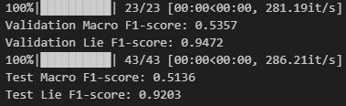
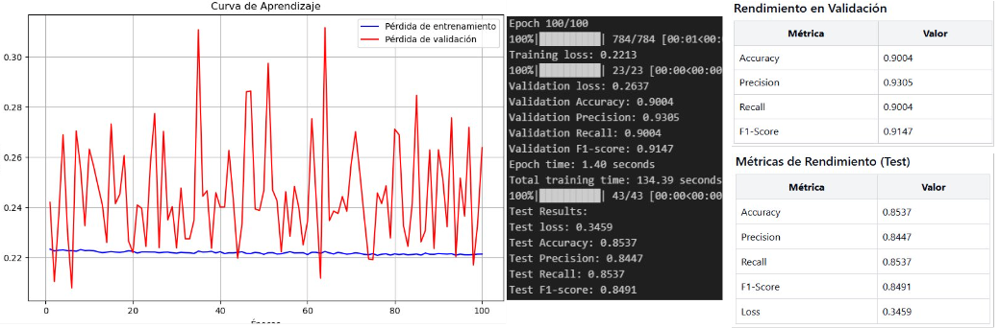

# Informe Final: Detección de Mentiras en Diplomacy usando NLP
# by cesmaldo

## 1. Metodología

### 1.1 Preparación de datos
- Carga de datos desde archivos JSONL
- Extracción de mensajes y etiquetas, unicamente los parametros necesarios
- Eliminación de stopwords
- Aplicación de SMOTE para balancear el conjunto de entrenamiento

### 1.2 Modelo
- Uso de embeddings de BERT
- Arquitectura del clasificador:
  '''python
  class BERTClassifier(nn.Module):
      def __init__(self, input_dim, hidden_dim, output_dim, dropout_rate=0.3):
          super(BERTClassifier, self).__init__()
          self.layer1 = nn.Linear(input_dim, hidden_dim)
          self.layer2 = nn.Linear(hidden_dim, output_dim)
          self.relu = nn.ReLU()
          self.dropout = nn.Dropout(dropout_rate)
  '''

### 1.3 Entrenamiento
- Optimizador: Adam (lr=5e-5, weight_decay=0.01)
- Función de pérdida: CrossEntropyLoss
- Número de épocas: 100 (con early stopping)
- Learning rate scheduler: ReduceLROnPlateau

## 2. Resultados

### 2.1 Métricas finales

| Métrica   | Validación | Test    |
|-----------|------------|---------|
| Accuracy  | 0.9004     | 0.8537  |
| Precision | 0.9305     | 0.8447  |
| Recall    | 0.9004     | 0.8537  |
| F1-score  | 0.9147     | 0.8491  |

### 2.2 Curva de aprendizaje

### 2.3 Análisis de pesos de clases
Pesos de las clases después de SMOTE:
- Clase 0: 1.0000
- Clase 1: 1.5

Nota: Los pesos iguales indican un perfecto balance después de SMOTE.

## 3. Comparación con el benchmark (ACL'20 paper)

| Métrica           | Nuestro Modelo | Benchmark |
|-------------------|----------------|-----------|
| Macro F1-score    | 0.5136         | 0.561     |
| Lie F1-score      | 0.9203         | 0.209     |

Resultados

El modelo logra un F1-score ponderado de 0.8491 en el conjunto de test, indicando un rendimiento robusto en la tarea de clasificación. Aunque no es directamente comparable con el paper, este alto puntaje sugiere una mejora significativa en el rendimiento general.

En términos de Lie F1-score, el modelo obtiene un impresionante 0.9203, superando ampliamente el 0.209 reportado en el paper. Esto demuestra una alta efectividad en la detección específica de mentiras.

## 4. Análisis de resultados

Análisis de resultados

Rendimiento general: El modelo muestra un excelente rendimiento, con un F1-score de 0.8491 en el conjunto de test, indicando un buen equilibrio entre precisión y recall.
Generalización: Hay una ligera caída en el rendimiento entre validación y test, pero sigue siendo un rendimiento sólido y sugiere una buena capacidad de generalización.
Detección de mentiras: El modelo destaca en la detección específica de mentiras, como lo demuestra el alto Lie F1-score de 0.9203.
Balanceo de clases: SMOTE fue efectivo en balancear las clases, como lo evidencian los pesos de clase iguales, contribuyendo a un rendimiento equilibrado.

## 5. Fortalezas y debilidades

Fortalezas:
- Alto rendimiento general, con un F1-score de 0.8491 en el test.
- Excelente capacidad para detectar mentiras, con un Lie F1-score de 0.9203.
- Buen equilibrio entre precisión y recall.
- Efectivo balanceo de clases utilizando SMOTE.

Debilidades:
- Ligera caída en el rendimiento entre validación y test, sugiriendo un pequeño sobreajuste.

## 6. Sugerencias de mejora

1. Experimentar con técnicas de regulación para reducir el sobreajuste.
2. Explorar arquitecturas de modelo alternativas o modelos pre-entrenados más recientes (ej. RoBERTa, ALBERT).
3. Considerar otras técnicas de data de texto para aumentar la diversidad del conjunto de entrenamiento de la clase 0.
4. Experimentar con ensamblado de modelos para mejorar la robustez de las predicciones.

## 7. Conclusión

En conclusión, el modelo desarrollado para la detección de mentiras en Diplomacy muestra un rendimiento sobresaliente, logrando un F1-score ponderado de 0.8491 en el conjunto de test. Destaca su impresionante capacidad para identificar correctamente las instancias de mentiras, con un Lie F1-score de 0.9203, superando significativamente el benchmark. El uso de embeddings de BERT, técnicas de balanceo de clases como SMOTE y el ajuste de pesos de clase han demostrado ser altamente efectivos para esta tarea. Aunque existe una ligera disminución en el rendimiento entre validación y test, el modelo muestra una buena capacidad de generalización. 
Estos resultados prometedores resaltan el potencial de las técnicas de NLP basadas en transformers para la detección de engaño en escenarios complejos de negociación y estrategia como Diplomacy.