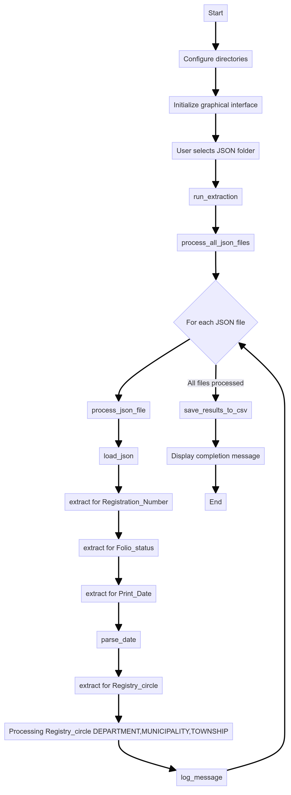

# Extractor de Información de Certificados de Propiedad

## Descripción del Proyecto
Este proyecto implementa un sistema de extracción de información clave de certificados de propiedad inmobiliaria colombianos. Utiliza los resultados de OCR generados por AWS Textract para procesar y extraer datos específicos de los documentos JSON.

## Características Principales
- Extracción precisa de: Número de Matrícula, Fecha de Impresión, Departamento, Municipio, Vereda y Estado del Folio.
- Interfaz gráfica simple para la selección de archivos y ejecución del proceso.
- Manejo robusto de variaciones en el texto mediante búsqueda difusa y normalización.
- Generación de resultados en formato CSV para fácil análisis.
- Sistema de logging para seguimiento y depuración.

## Requisitos del Sistema
- Python 3.7+
- Bibliotecas: tkinter, unidecode, fuzzywuzzy

## Instalación
1. Instale las dependencias: pip install unidecode fuzzywuzzy

## Uso
1. Ejecute el script principal:  extractor_certificados_tradicion.py
2. Use la interfaz gráfica para seleccionar la carpeta con los archivos JSON.
3. El programa procesará los archivos y guardará los resultados en la carpeta 'results y crea un logs'.

## Estructura del Proyecto
- `extractor_certificados_tradicion.py`: Script principal.
- `results/`: Carpeta donde se guardan los resultados diarios en formato CSV.
- `logs/`: Carpeta donde se almacenan los logs de ejecución.
- `json/`: Carpeta donde deben colocarse los archivos JSON a procesar.

## Metodología y Enfoque Técnico
1. **Análisis de Requisitos**: Identificación de campos clave a extraer.
2. **Procesamiento de Datos**: Uso de técnicas de procesamiento de texto y expresiones regulares.
3. **Manejo de Variaciones**: Implementación de búsqueda difusa y normalización de texto.
4. **Estructura Modular**: Código organizado en funciones específicas para cada tarea.
5. **Manejo de Errores**: Sistema de logging y manejo de excepciones.

## Diagrama de Flujo

## Precisión y Resultados
- Precisión del 100% en pruebas con el archivo 001-pag1_prueba.json.
- La precisión puede variar dependiendo de la calidad del OCR inicial de AWS Textract.

## Limitaciones y Mejoras Futuras
- Implementación de técnicas de aprendizaje automático para mejorar la extracción.
- Ampliación de la capacidad para extraer palabras de interés adicionales.
- Optimización del rendimiento para procesar grandes volúmenes de documentos.

## Autor
Cesar Augusto Maldonado Parra

## Nota 
Para una explicación más detallada del enfoque, implementación y resultados, por favor refiérase a la presentación PowerPoint adjunta.